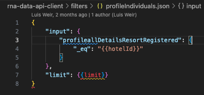
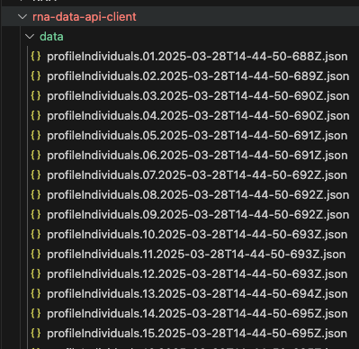

# R&A Data APIs Use Cases

- [0 Introduction](#0-introduction)
- [1 Setting up Postman](#1-setting-up-postman)
- [2 Setting up the Client](#2-setting-up-the-client)
- [3 Get Token](#3-get-token)
- [4 Fetch Profiles changed in the last 3 days](#4-fetch-profiles)
- [5 Fetch Reservations changed in the last 3 days](#5-fetch-reservations)
- [6 Fetch Transaction details for these reservations](#6-fetch-transaction-details)
- [7 Fetch Using Client](#7-fetch-using-client)

## 0 Introduction

In this bootcamp, we will go through the usage of R&A Data APIs to fetch data using streaming technologies from your R&A platform.

For the first four steps either Postman or a Node JS client.

## 1 Setting up Postman

1. Download the [R&A Data APIs Postman collection in this repository](ra-data-apis---bootcamp.postman_collection.json) and import this to Postman
2. Ensure you have imported the [Bootcamp Reseller Postman environment in this repository](bootcamp-reseller.postman_environment.json)
3. Ensure the Bootcamp Reseller Postman environment is configured following this guide [Basic Setup](basic-setup.md).
4. Ensure the application key listed in the `AppKey` variable in the Postman environment is the application Oracle set up with access to the R&A Data APIs.

## 2 Setting up the Client

Note that the [Node JS client](https://github.com/luisweir/rna-data-api-client) is for demonstration purposes only and is not meant to serve as a reference implementation.

The lab uses the demonstration node based client to invoke the R&A Data API and store the response into a file.

### Pre-Requisites

1. Git
2. Node

### Installing the Client

1. Clone or download the client code

```shell
git clone https://github.com/luisweir/rna-data-api-client
```

2. Install the node dependencies

```shell
cd rna-data-api-client
npm install
```

### Folder Structure for the Client

```text
rna-data-api-client
├── .env
├── data
│   └──<fetch_response>.json
├── filters
│   └──<filter_name>.json
├── queries
│   └──<query_name>.gql
└── src
```

### Configure the Client

1. Create a .env file if not present already

```shell
touch .env
```

2. Add the required config into .env file

   | Property | Description  |
   | -------- | ------------ |
   |`APIGW_URL`   | OHIP Gateway URL |
   |`APP_KEY`      | OHIP application key.  Ensure this is the application that Oracle set up with access to the R&A Data APIs. |
   |`CLIENT_ID`    | client_id to generate OAuth Token for Authentication |
   |`CLIENT_SECRET`| client_secret to generate OAuth Token for Authentication |
   |`ENTERPRISE_ID`| enterprise identifier related to the customer environment |
   |`EXCLUDE_NULL`| Set to true to remove null values from responses |
   |`PLUGIN_NAME`| Specifies which plugin should be used for processing data streams |
   |`QUERY_NAME`| File name for the query to be used while preparing the request|
   |`FILTER_NAME`| File name for the filter conditions to be used while preparing the request |
   |`FILTER_VARS`|Defines dynamic variables for filters. Takes comma separated variables with `key:value` format |
   |`ENABLE_PROXY`| Enable or Disable System Proxy for the request being Sent|

Example:

```shell
APIGW_URL=https://mucu1ua.hospitality-api.us-ashburn-1.ocs.oc-test.com
APP_KEY=****
CLIENT_ID=****
CLIENT_SECRET=****
ENTERPRISE_ID=OCR4ENT
EXCLUDE_NULL=true
PLUGIN_NAME=fileWriter
QUERY_NAME=profileIndividuals
FILTER_NAME=profileIndividuals
FILTER_VARS=hotelId:OHIPSB01,limit:100000
ENABLE_PROXY=false
```

Note that the values for the following change during the lab:

- `QUERY_NAME`
- `FILTER_NAME`
- `FILTER_VARS`

### Filters and filter variables

Filters are stored in files in the "filters" folder.

Variables can be used in filters.  To create a place holder for a variable, insert the variable name in jinja template format. Example: `{{hotelId}}`.

For example, the variables `{{hotelId}}` and  `{{limit}}` are used in the below filter:

  

The values of variables are passed in the `.env` file as an array.  For example, `hotelId:OHIPSB01,limit:100000` which means:

1. hotelId = OHIPSB01
2. limit = 100000

### Running the client

1. After making the necessary configuration changes needed, run the script to fetch the data

```shell
npm start
```

2. If the fileWriter plugin is selected the output of each response chunk is saved into individual json file in the data folder

   

3. Requests Stats like no of records, no of chunks and Time Stats can be seen in the output of the script

Example:


## 3 Get Token

> NOTE: This is only required when using the Postman collection.  The client automatically obtains an oAuth token.

In Postman, expand the `R&A Data API - bootcamp` collection and click the `Get OAuth Token` request.

Click `Send`.

This automatically copies the token to the environment variable `Token`.

Scripts automatically obtain a new oAuth token when the token expires.

## 4 Fetch Profiles

This fetches the profiles you've modified during the OHIP Lab and stores them locally.

The query uses the Profile-Individuals Subject Area API.

### 4.1 Fetching Profiles Using Postman

Having first run the `Get OAuth Token` request click the request `demo 1 - profiles` and click `Send`.

This query filters the Profile-Individuals Subject Area by the property you've been using as well as by their updated date.

#### 4.1.1 Amending the Fetch Profiles Query Using Postman

Modify the "Query" section to change what data to return.  Postman offers typeahead to the schema.

#### 4.1.2 Amending the Fetch Profiles Filter Using Postman

Modify the "GraphQL Variables" section to return profiles changed in the last 3 days in the property you've been using.

### 4.2 Fetching Profiles Using the Client

Set the `.env` file properties to the following:

|Variable Name|Value|
|-------------|------|
|`QUERY_NAME`|profileIndividuals|
|`FILTER_NAME`|profileIndividuals|
|`FILTER_VARS`|"hotelId:OHIPSB01,limit:100000"|

Then send `npm start`.

#### 4.2.1 Amending the Fetch Profiles Query Using the Client

Queries are stored in the "queries" folder.

Amend the `profileIndividuals.gql` query file by adding or removing fields.  We recommend building the query in Postman then copying it into the saved query.

Then send `npm start`.

#### 4.2.2 Amending the Fetch Profiles Filter Using the Client

Filters are saved filters in the "filters" folder.

Amend the `profileIndividuals.json` filter file to filter profiles changed in the last 3 days in the property you've been using.

This will require:

1. Changing the `profileIndividuals.json` filter file.  Use the "GraphQL Variables" section of the Postman request "demo 2 - multi SA".
2. Passing the property code in the `FILTER_VARS` variable in `.env`.
3. Passing the start date and end date in the `FILTER_VARS` variable in `.env`.

### Input parameters needed for Fetch Profiles

- `profileallDetailsResortRegistered` (optional)
- `profileallDetailsUpdateDate`

## 5 Fetch Reservations

Here you will be fetching the reservations you've created during the OHIP Lab and store them locally.

For this, you'll use the Booking-Reservation Subject Area API.

### 5.1 Fetching Reservations Using Postman

Having first run the `Get OAuth Token` request click the request `ws2 - reservations` and click `Send`.

This query filters the Booking-Reservation Subject Area by the property you've been using as well as by the reservations' updated date.

### 5.2 Fetching Reservations Using the Client

Set the `.env` file properties to the following:

|Variable Name|Value|
|-------------|------|
|`QUERY_NAME`|reservations|
|`FILTER_NAME`|reservations|
|`FILTER_VARS`|"hotelId:OHIPSB01,dateFrom:2025-03-01,dateTo:2025-03-01"|

Then send `npm start`.

### Input parameters needed for Fetch Reservations

- `reservationDetailsResort`
- `reservationDetailsTruncBeginDate`
- `reservationDetailsTruncEndDate`

## 6 Fetch Transaction Details

Here you will be fetching the transactions you've created during the OHIP Lab and store them locally.

For this, you'll use the Financial-TransactionDetails Subject Area API.

### 6.1 Fetching Transactions Using Postman

Having first run the `Get OAuth Token` request click the request `ws3 - transactions` and click `Send`.

This query filters the Financial-TransactionDetails Subject Area by their business and transaction dates.

### 6.2 Fetching Transactions Using the Client

Set the `.env` file properties to the following:

|Variable Name|Value|
|-------------|------|
|`QUERY_NAME`|financialTransactionsSummary|
|`FILTER_NAME`|financialTransactionsSummary|
|`FILTER_VARS`|"dateFrom:2025-03-01,dateTo:2025-03-01"|

Then send `npm start`.

### 6.2.1 Fetching Transactions for given Date and Hotel Using the Client

Either amend the query and filter or use the values below to obtain transaction details for a single property and a single transaction date.

|Variable Name|Value|
|-------------|------|
|`QUERY_NAME`|financialTransactionDetails|
|`FILTER_NAME`|financialTransactionDetails|
|`FILTER_VARS`|"hotelId:OHIPSB01,date:2025-03-01"|

### Input parameters needed for Fetch Transaction Details

- `financialtransDetailsResvNameId`
- `financialtransDetailsBusinessdate`
- `financialtransDetailsResort`
- `financialtransDetailsTrxDate`
