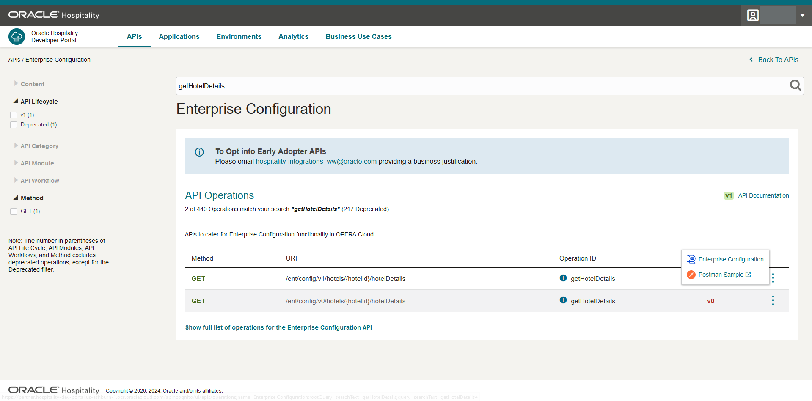
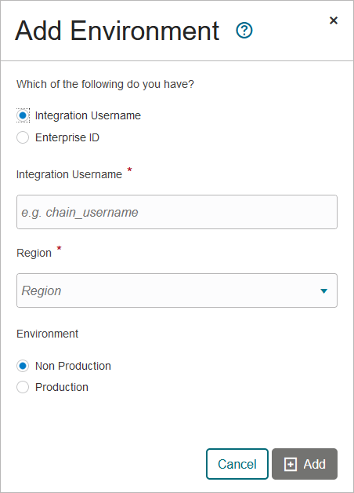
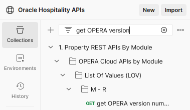

# Basic Setup

Getting started with Oracle Hospitality Integration Platform is easy.  Follow these steps.

1. [Accessing the Developer Portal](#1-accessing-the-developer-portal)
2. [Understanding the Developer Portal](#2-understanding-the-developer-portal)
3. [Obtaining Credentials](#3-obtaining-credentials)
4. [Authentication Flows](#4-authentication-flows)
5. [Setting up Postman](#5-setting-up-postman)
6. [Obtaining an oAuth Token](#6-obtaining-an-oauth-token)
7. [Calling the getHotelDetails API](#7-calling-the-gethoteldetails-api)
8. [Finding the OPERA version of the environment](#8-finding-the-opera-version-of-the-environment)
9. [Analytics](#9-view-analytics)

## 1. Accessing the Developer Portal

1. Create a Developer Portal user.  See [Adding Developer Portal Users](https://docs.oracle.com/en/industries/hospitality/integration-platform/ohipu/t_getting_started_for_partners.htm#OHIPU-AddingUsers-3E28413A)
2. Assign the `ApplicationDeveloper` role to the Developer Portal user.  See [Assigning Users to Roles](https://docs.oracle.com/en/industries/hospitality/integration-platform/ohipu/t_getting_started_for_partners.htm#OHIPU-AssigningUsersToRoles-879F91FD)
3. Sign in to the Oracle Hospitality Developer Portal.  See [Signing In to the Oracle Hospitality Developer Portal](https://docs.oracle.com/en/industries/hospitality/integration-platform/ohipu/t_getting_started_for_partners.htm#OHIPU-SigningInToTheDeveloperPortal-DC32FEE5)

## 2. Understanding the Developer Portal

1. Searching for the Customer Relationship Management API.  See [API Search Engine](https://docs.oracle.com/en/industries/hospitality/integration-platform/ohipu/ch_discover_and_subscribe_to_APIs.htm#OHIPU-APISearchEngine-3C569607)
2. View the API specifications for the V1 Customer Relationship Management API
3. Search for the operation `getHotelDetails`
4. Find the example request in Postman for `getHotelDetails` 
5. Find the workflow for checking in
6. Create an application and subscribe it to the Property APIs.  See [Registering an Application](https://docs.oracle.com/en/industries/hospitality/integration-platform/ohipu/c_register_and_manage_applications.htm#OHIPU-CreatingAnApplication-D59E4A5D).  Note down the Application Key.

## 3. Obtaining credentials

In this lab, we are using an environment on the Resource Owner grant.

1. Create an integration user via the Shared Security Domain vendor self-registration portal.  Use the `Tenant` code supplied by the Oracle team.  Enter your company name in the `Vendor` field, without spaces and to a maximum of 10 characters.  Fill in the contact details and security questions.  Note down the `Interface ID` and `Interface Key`; these are your username and password.  See [Authenticating to Oracle Hospitality Property APIs](https://docs.oracle.com/en/industries/hospitality/integration-platform/ohipu/c_oracle_hospitality_property_apis.htm#OHIPU-AuthenticatingToOracleHospitalityPr-1BD54F80)
2. Let the Oracle team know your your `Interface ID` so they can approve access.  In production, this would be approved by the hoteliers.
3. On the Environments page add an environment, specifying your Integration Username (`Interface ID`), choosing the region and environment type listed by the Oracle team.  See [Adding an Environment](https://docs.oracle.com/en/industries/hospitality/integration-platform/ohipu/t_adding_an_environment.htm) 
4. View and note down the gateway URL, clientId and clientSecret

## 4. Authentication Flows

Oracle Hospitality APIs are protected by oAuth2.  There are two "flows" used in Oracle Hospitality APIs: Client Credentials, and Resource Owner.  These flows refer to which credentials are needed to obtain an oAuth token.  In this lab we're using an environment on the Resource Owner grant.

## 5. Setting up Postman

1. Download the latest Postman collections and the [Postman Environment](https://github.com/oracle/hospitality-api-docs/blob/main/postman-collections/oracle-hospitality-property.postman_environment.json) from the [Oracle Hospitality Github repository](https://github.com/oracle/hospitality-api-docs/tree/main/postman-collections)
2. Import these Postman collections and Environment into Postman
3. In the Postman Environment fill in the below details:

| **Variable Name** | **Value** |
| --- | --- |
| AppKey | Application key you noted down in [Understanding the Developer Portal](#understanding-the-developer-portal) |
| ClientId | ClientId obtained from the Environment card in [Obtaining Credentials](#obtaining-credentials) |
| ClientSecret | ClientSecret obtained from the Environment card in [Obtaining Credentials](#obtaining-credentials) |
| HostName | Gateway URL obtained from the Environment card in [Obtaining Credentials](#obtaining-credentials) |
| HotelId | Value supplied by the Oracle team |
| Password | `Interface Key` from the Vendor Self-Registration Portal in [Credentials](#obtaining-credentials) |
| Username | `Interface ID` from the Vendor Self-Registration Portal in [Credentials](#obtaining-credentials) |

## 6. Obtaining an oAuth token

1. Expand the "Property REST APIs by Module" collection, inside the "OAuth Token" folder
2. Click the saved request `POST Get OAuth Token //initialize currentdate`
3. Click Send
4. Note that this populates the variable `Token` in the Postman environment with the value `access_token` returned in the response

## 7. Calling the getHotelDetails API

1. Search for the getHotelDetails saved request in Postman (it's in the "Property REST APIs by Module" collection in the folder "OPERA Property APIs by Module" > "Enterprise Configuration (ENT Config)").  _Note_ for ease of reading, operationIds are separated by spaces, thus `getHotelDetails` appears as `get Hotel Details` 
2. Click Send.  This works because it uses the oAuth token in the Postman Environment

## 8. Finding the OPERA version of the environment

1. Search for the `get OPERA version` saved request in Postman (it's in the "Property REST APIs by Module" collection in the folder "List of Values (LOV)" > "M-R") 
2. Click Send.  Read the `operaVersion` from the response payload

## 9. View analytics

1. Go back to the Developer Portal and click on the Analytics tab.  See [Analytics](https://docs.oracle.com/en/industries/hospitality/integration-platform/ohipu/c_analytics.htm#OHIPU-Analytics-EC725F0D)
2. See the calls made just now in the analytics
3. Filter down to the Enterprise Configuration API to see just the calls we made to `getHotelDetails`, along with any other operations we called in the Enterprise Configuration API
